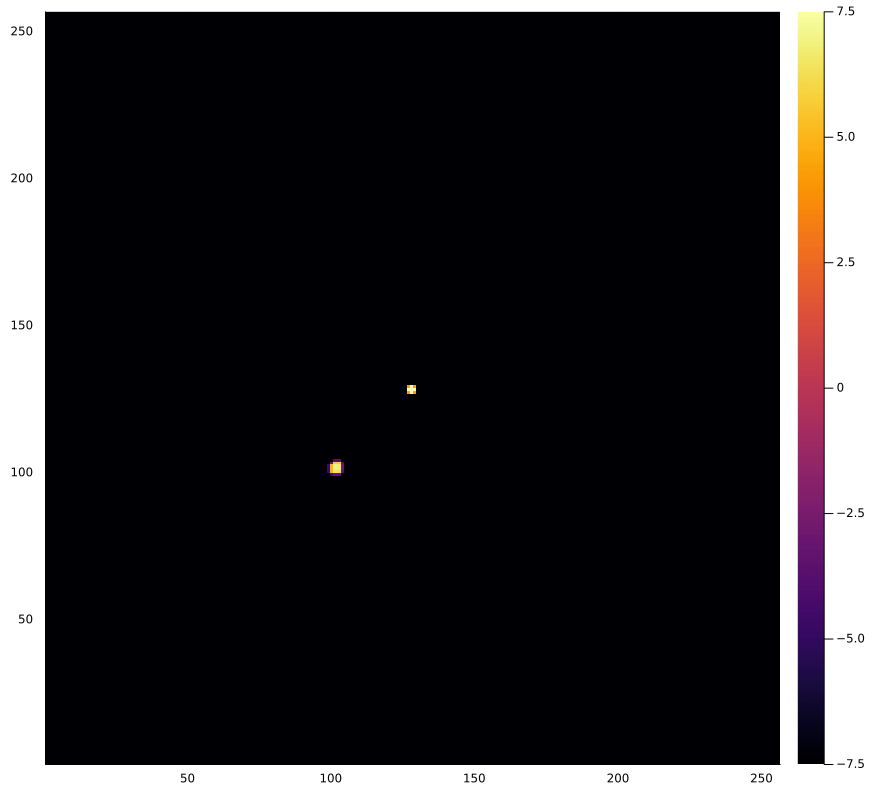

<h1 align="center"> Hi there! 👋 I'm Sparsha </h1>

  

I am a 3rd year undergraduate student majoring in physics at [IISER Mohali](https://www.iisermohali.ac.in/).

I am fascinated by astrophysics, mathematics, and computer science. And I love to play around with generative art too! Thank you for stopping by 🍀

The above GIF is a simulation of a tidal disruption event. It is generated by the Folfox code (being developed jointly by me, Rajnil, and Eshna) for simulation of self-gravitating fluids.
